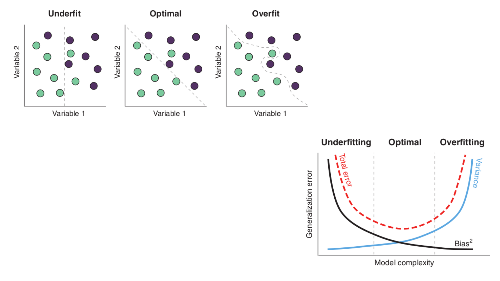
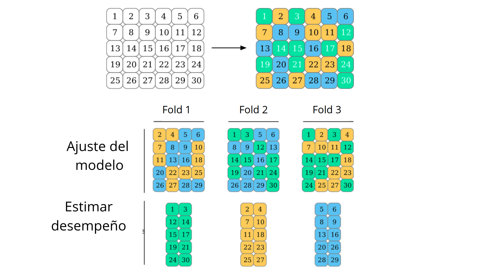
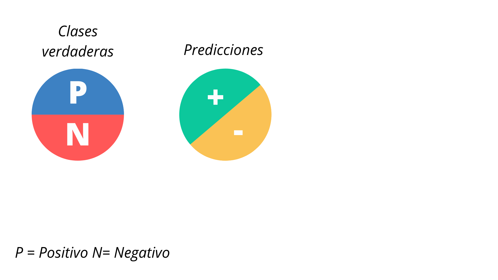
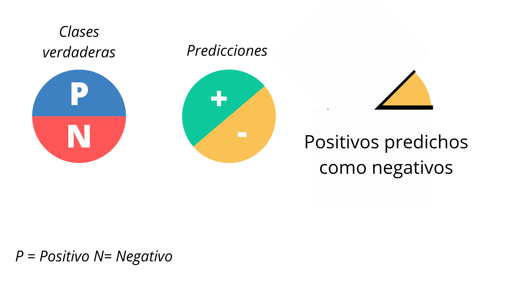
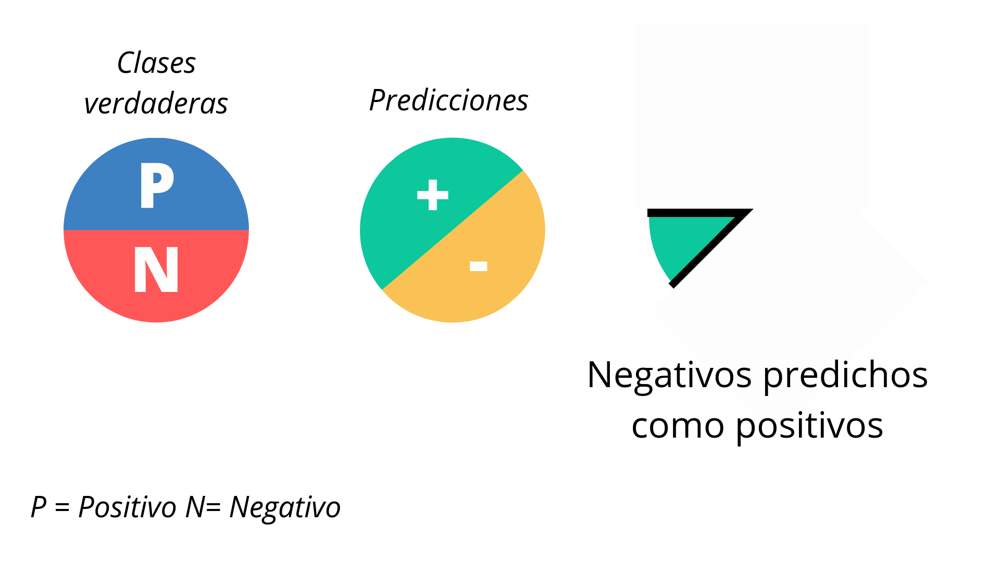
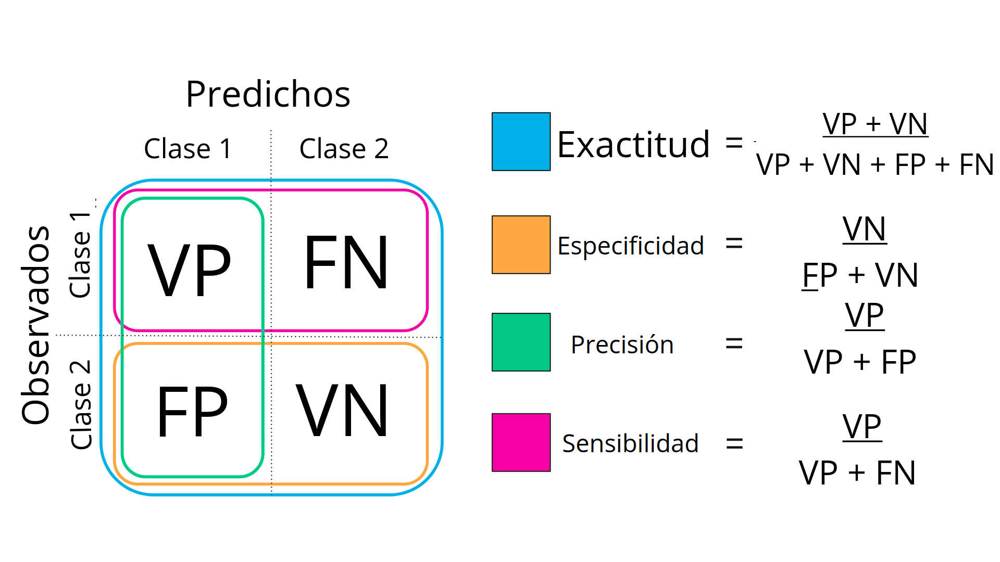

---
output:
  xaringan::moon_reader:
    lib_dir: libs
    css: xaringan-themer.css
    nature:
      highlightStyle: github
      highlightLines: true
      countIncrementalSlides: false
---

background-image: url(img/portada.png)
background-size: cover
class: animated slideInRight fadeOutLeft, middle


```{r setup, include=FALSE}
options(htmltools.dir.version = FALSE)
```

```{r xaringan-themer, include=FALSE, warning=FALSE}
library(xaringanthemer)
style_duo_accent(
  primary_color = "#6c5396",
  secondary_color = "#534173",
  inverse_header_color = "#FFFFFF"
)
```

```{r , message=FALSE, warning=FALSE, include=FALSE} 
library(fontawesome)
library(emo)
```

```{r xaringan-logo, echo=FALSE}
xaringanExtra::use_logo("img/logo-tidymodels.png")
```


```{r xaringan-tachyons, echo=FALSE}
xaringanExtra::use_tachyons()
```


# Introducción a Machine Learning con Tidymodels 


### 1º Congreso Latinoamericano de Mujeres en Bioinformática y Ciencia de Datos


---

## Equipo 

```{r echo=FALSE, out.width = '100%'}
knitr::include_graphics("img/equipo.png")
```
  

---


## Material de este tutorial 
<br><br>
## `r emo::ji("earth_americas")` https://ml-tidy-wibds.netlify.app/

<br><br>
## `r fa("github", fill = 'black')` https://bit.ly/ml-wibds 


---

## Cronograma


---

## ¿Qué es modelar? 

.bg-near-white.b--purple.ba.bw2.br3.shadow-5.ph4.mt5[
### Es el proceso de desarrollo de una herramienta matemática que genera una predicción precisa. 
### Entrenamos un modelo para encontrar esa predicción precisa. <sup>*</sup>
]


.footnote[<sup>*</sup> Applied Predictive Modeling]
---

## ¿Qué es el aprendizaje automático? 

.bg-near-white.b--purple.ba.bw2.br3.shadow-5.ph4.mt5[
### El aprendizaje automático (ML)-también llamado aprendizaje estadístico- es un subcampo dentro de la inteligencia artificial (IA) donde *los algoritmos "aprenden" patrones en los datos para realizar una tarea específica.* 

]

---

## Conceptos Importantes

* __Muestra, punto, observación, instancia__ se refiere a una unidad de análisis.
<br>

* __Set de entrenamiento__ son los datos utilizados para el modelado. 
<br>

* __Set de prueba__ son los datos utilizados para medir el desempeño del modelo, entre un conjunto de candidatos. 
<br>

* __Atributos, predictores, variables independientes o descriptores__ son los datos de entrada para la ecuación de predicción.
<br> 
* __Salida, variable dependiente, variable respuesta, clase, o "target"__ es la cantidad a ser predicha. 
<br>

* __Datos categóricos, también conocidos como nominales o atributos__ toman valores específicos que no tienen escala. Ejemplo: bueno/malo, rojo/azul, etc. 
<br>
* __Datos continuos__ son a base de escalas numéricas. El costo de un producto, la presión sanguínea, etc.

.footnote[<sup>*</sup> Applied Predictive Modeling]

---

## En una matriz de datos 


---

## Aprendizaje automático e IA


```{r echo=FALSE, out.width = '75%',  fig.align='center'}
knitr::include_graphics("img/ml-ia.png")
```


.footnote[<sup>*</sup> ]

---

## El aprendizaje automático y otros campos relacionados


```{r echo=FALSE, out.width = '90%',  fig.align='center'}
knitr::include_graphics("img/ml-related.png")
```

Fuente: [link](https://ldi.upenn.edu/sites/default/files/Introduction-to-Machine-Learning.pdf)
---

## Aplicaciones en la biología molecular


### [AlphaFold: plegamiento de proteínas](https://deepmind.com/blog/article/AlphaFold-Using-AI-for-scientific-discovery) 


```{r echo=FALSE, out.width = '90%',  fig.align='center'}
knitr::include_graphics("img/prot-fold.png")
```


#### [De novo generation of hit-like molecules from gene expression signatures using artificial intelligence](https://www.nature.com/articles/s41467-019-13807-w)

---

### Otros hitos en el campo de la IA

        
```{r echo=FALSE, out.width = '100%',  fig.align='center'}
knitr::include_graphics("img/AI-hits.png")
```


---

## Tipos de aprendizaje
        
```{r echo=FALSE, out.width = '90%',  fig.align='center'}
knitr::include_graphics("img/ml.png")
```


---

## Aprendizaje supervisado

```{r echo=FALSE, out.width = '90%',  fig.align='center'}
knitr::include_graphics("img/supervised.png")
```

.footnote[<sup>*</sup> Machine Learning with R, the tidyverse and mlr]

---

## Aprendizaje no supervisado


```{r echo=FALSE, out.width = '90%',  fig.align='center'}
knitr::include_graphics("img/unsupervised.png")
```
    
.footnote[<sup>*</sup> Machine Learning with R, the tidyverse and mlr]

---

## Bias - Variance tradeoff

```{r echo=FALSE, out.width = '90%',  fig.align='center'}

```


*Para una introducción visual ver: http://www.r2d3.us/visual-intro-to-machine-learning-part-2/*


.footnote[<sup>*</sup> Machine Learning with R, the tidyverse and mlr]

---

# Exploración de datos


.bg-near-white.b--purple.ba.bw2.br3.shadow-5.ph4.mt5[
### La exploración de datos es un proceso iterativo en el que uno genera preguntas sobre sus datos, busca respuestas mediante la visualización y transformación de los mismos. Esto me permite afinar las preguntas e incluso, generar nuevas preguntas.

]

.footnote[Fuente: https://r4ds.had.co.nz/exploratory-data-analysis.html]
---

## Cobran especial importancia en esta etapa


.bg-near-white.b--purple.ba.bw2.br3.shadow-5.ph4.mt5[

#### Estudio de la distribución de las variables

#### Presencia de valores perdidos

#### Desbalance de las clases o grupos en estudio

#### Presencia de datos extremos. 

#### Covariación de variables

]

.footnote[Fuente: https://r4ds.had.co.nz/exploratory-data-analysis.html]


---

# Entrenamiento y testeo


---
## Resampleo 

El resampleo se utiliza en ML para estimar el desempeño de un modelo. 


```{r echo=FALSE, out.width = '100%',  fig.align='center'}
knitr::include_graphics("img/resampling.png")
```


.footnote[Fuente: https://www.tmwr.org/resampling.html]

---


## Validación cruzada


```{r echo=FALSE, out.width = '100%',  fig.align='center'}

```


.footnote[Fuente: https://www.tmwr.org/resampling.html]


---

## Bootstraping 
## (muestreo con reemplazo)


.footnote[Fuente: https://www.tmwr.org/resampling.html]
---

# Árboles de decisión

  
```{r echo=FALSE, out.width = '100%',  fig.align='center'}
knitr::include_graphics("img/bret-tree.png")
```


---

# Árboles de decisión

 
```{r echo=FALSE, out.width = '100%',  fig.align='center'}
knitr::include_graphics("img/decision1.png")
```


---

# Random Forest


---
# Métricas


.bg-near-white.b--purple.ba.bw2.br3.shadow-5.ph4.mt5[

### Durante el modelado de datos es probable que no hagamos un solo modelo, sino varios. 
### La manera de saber qué tan buenos son, es evaluar esos algoritmos mediante métricas.
### Tenemos métricas de regresión y clasificación.
]


---

## Métricas en la clasificación

     
  
```{r echo=FALSE, out.width = '100%',  fig.align='center'}

```

---

# Positivos verdaderos
     
  
```{r echo=FALSE, out.width = '100%',  fig.align='center'}
knitr::include_graphics("img/metricas2.png")
```


---

## Falsos positivos 
  
```{r echo=FALSE, out.width = '100%',  fig.align='center'}

```


---

# Negativos verdaderos
  
```{r echo=FALSE, out.width = '100%',  fig.align='center'}
knitr::include_graphics("img/metricas4.png")
```

---

## Falsos Negativos  
  
```{r echo=FALSE, out.width = '100%',  fig.align='center'}

```


---

## Matriz de Confusión
      
  
```{r echo=FALSE, out.width = '100%',  fig.align='center'}

```

    


.footnote[Traducido de 10.7717/peerj.5666/fig-2]


---

## Principios del aprendizaje

### 1. Navaja de Occam


.bg-near-white.b--purple.ba.bw2.br3.shadow-5.ph4.mt5[

### El modelo más simple que pueda ser ajustado es el más factible.

#### Si tuviéramos para elegir entre un modelo simple y uno complejo con el mismo desempeño, debo preferir **siempre** el modelo más simple
]


.footnote[__Learning from data__ Abu-Mostafa, Y.]

---

## Principios del aprendizaje

### 2. Bias en el muestreo (sampling bias)


.bg-near-white.b--purple.ba.bw2.br3.shadow-5.ph4.mt5[

### Si los datos contienen un sesgo, el algoritmo tendrá ese mismo sesgo.
]


.footnote[__Learning from data__ Abu-Mostafa, Y.]

---

## Principios del aprendizaje

### 3. Data snooping

.bg-near-white.b--purple.ba.bw2.br3.shadow-5.ph4.mt5[

### El set de datos de testeo no debe usarse nunca durante la fase de entrenamiento, ya que esto arrojará resultados más optimistas que los esperados. 
]

.footnote[__Learning from data__ Abu-Mostafa, Y.]

---
## De caret a tidymodels


.pull-left[
El objetivo de caret era **unificar la sintaxis** para modelizar datos usando como base distintas librerías de R. 

]

--

.pull-right[
El objetivo de Tidymodels es además hacerlo **en un formato ordenado**. 


]


---
## Tidymodels

.bg-near-white.b--purple.ba.bw2.br3.shadow-5.ph4.mt5[

### Tidymodels es un grupo de paquetes centrado en las tareas de modelización de datos. 
### La modelización consta de varios pasos, la idea es que cada paso lo realice una librería diferente. 
]


.footnote[Sitio web: https://www.tidymodels.org/]

---

# Etapas del modelado de datos


  
```{r echo=FALSE, out.width = '100%',  fig.align='center'}
knitr::include_graphics("img/modeling.png")
```

.footnote[Sitio web: https://www.tmwr.org/software-modeling.html]


---

## Modelado y tidymodels


```{r echo=FALSE, out.width = '100%',  fig.align='center'}
knitr::include_graphics("img/tidy-w.png")
```

---
class: inverse, center

# Datos 


---

## Datos: Palmer Penguins


```{r eval=FALSE}
install.packages("palmerpenguins") #ya disponible en CRAN
```


```{r echo=FALSE, out.width = '65%',  fig.align='center'}
knitr::include_graphics("img/penguins.png")
```


```{r echo=FALSE, out.width = '35%',  fig.align='right'}
knitr::include_graphics("img/pico.png")
```


.footnote[<sup>*</sup> https://github.com/allisonhorst/palmerpenguins]


---

## Exploración de datos

```{r message=FALSE}
library(palmerpenguins)
library(dplyr)
glimpse(penguins)
```
  
---


background-image: url(img/penguin2.jpg)
background-size: cover
class: inverse, animated slideInRight fadeOutLeft, middle


# Análisis Exploratorio

---

## Datos balanceados o desbalanceados

Veamos si las clases están balanceadas
```{r}
penguins %>%
  count(species)
```

**Las clases no están balanceadas**

Es importante saber si un set de datos está balanceado o desbalanceado, ya que eso introduce un **sesgo en los algoritmos**. 

---
```{r}
penguins %>%
  group_by(species) %>%
  summarize(across(where(is.numeric), mean, na.rm = TRUE))
```

---

## Valores perdidos

## Imputar valores perdidos

## Centrado y escalado


## 
---

background-image: url(img/penguin1.jpg)
background-size: cover
class: inverse, animated slideInRight fadeOutLeft, middle


# Aprendizaje 
# Supervisado


---
#  Arboles de decisión


---


# Random Forest


---


background-image: url(img/penguin3.jpg)
background-size: cover
class: inverse, animated slideInRight fadeOutLeft, middle


# Análisis 
# No Supervisado 

---

# Análisis de Componentes Principales


---

# UMAP


---

# K-Means


---


---

background-image: url(img/penguin4.jpg)
background-size: cover
class: inverse, animated slideInRight fadeOutLeft, middle


# Muchas 
# Gracias

---

# Bibliografía

---

# Imágenes utilizadas (Unsplash)

## Portada: https://unsplash.com/photos/WkfDrhxDMC8 

## Conceptos: https://unsplash.com/photos/7lzIyp2Ork4 

https://unsplash.com/photos/3dDa9p4FU9U 

https://unsplash.com/photos/8fmTByMm8wE 

https://unsplash.com/photos/RmOi5f7HfeE 